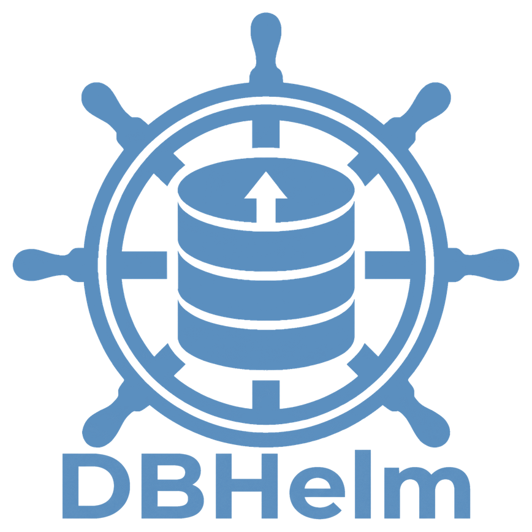

# DBHelm for VS Code

Snapshots, backups and safe database access for you and your coding agents.
**You hold the helm: agents ask, DBHelm asks you.**



## What it does

- **Snapshots and backups** of MongoDB, PostgreSQL, MySQL and SQLite databases, with one-click restore and a safety snapshot before every restore.
- **Agent access without handing over credentials.** Claude Code, Cursor, Codex and other agents reach your databases through `dbhelm agent`: reads run inside a database-enforced read-only transaction, and any change becomes a request that waits for you on the **Bridge**.
- **Manual Helm or Autopilot.** By default DBHelm waits for your permission. Switch on Autopilot and DBHelm approves ordinary changes for you (still snapshotting first and logging everything).
- **A Chart** to browse schema and data, read-only.
- **Works with any agent:** a Claude Code skill, plus an MCP server (`dbhelm mcp`) for Cursor, Codex and Claude Desktop.
- **A ship's log** of every agent call and decision, in your project's `.dbhelm/` folder.

## Get started

1. Open a project folder, then open **DBHelm** in the Activity Bar.
2. **Add Connection…** Leave the password out of the URI; DBHelm asks for it and keeps it in your system keychain.
3. Set **Agent access** for the connection (Off / Read / Read and ask to write).
4. **DBHelm: Set Up Agent Skill…** teaches this project's coding agents to use DBHelm. For MCP clients use **DBHelm: Add MCP Server to Project…**.

## How agents stay in bounds

| Guarantee | How |
|---|---|
| Reads cannot write | Postgres/MySQL `READ ONLY` sessions, SQLite `query_only`; Mongo pipelines with `$out`, `$merge` or server-side JavaScript are refused |
| No credentials | Agents see connection names only; errors are scrubbed of URIs and hosts |
| Agents cannot approve themselves | Approval and Autopilot need a token held only in this extension's memory |
| Fail closed | With VS Code closed, change requests are refused, never queued to run later |
| Undo | A safety snapshot is taken before every approved change |

DBHelm protects against an agent's mistakes and over-reach. It cannot stop malicious code running as your operating-system user. See `media/HELP.md` for the details.

## Requirements

The extension bundles the `dbhelm` binary for macOS, Linux and Windows (x64 and arm64). MongoDB backups also need the [MongoDB Database Tools](https://www.mongodb.com/try/download/database-tools) (`dbhelm doctor` checks). Snapshots do not.

## Settings

See `media/HELP.md`. The important ones: `dbhelm.safetySnapshot`, `dbhelm.autopilotAllowDangerous`, `dbhelm.autopilotMinutes`, and the App Lock settings.

## Development

```bash
cd extension
npm install
npm run build:binary   # go build into bin/<platform>-<arch>/
npm run compile        # tsc + webview check
npm test               # drives the compiled host code against the real binary
npm run package:all    # one VSIX per platform into dist/ (cross-compiles the Go binary)
```

Press F5 in VS Code to launch an Extension Development Host. `npm run package` builds a `.vsix`; release builds one per platform (`node scripts/build-binary.js --all`, then `vsce package --target <platform>`).

Unsigned builds: macOS may ask you to allow the bundled binary on first run.

## License

MIT.
